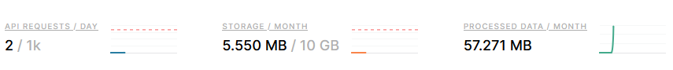
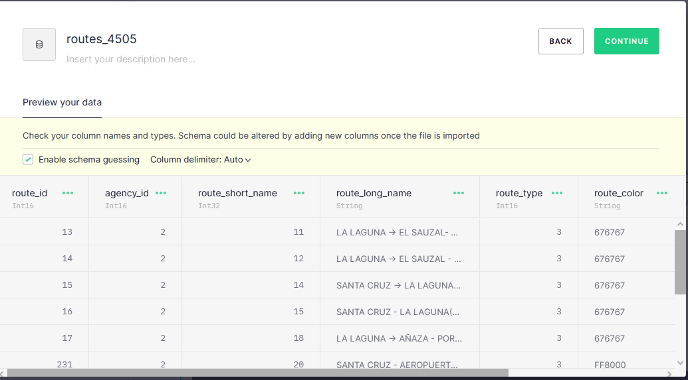
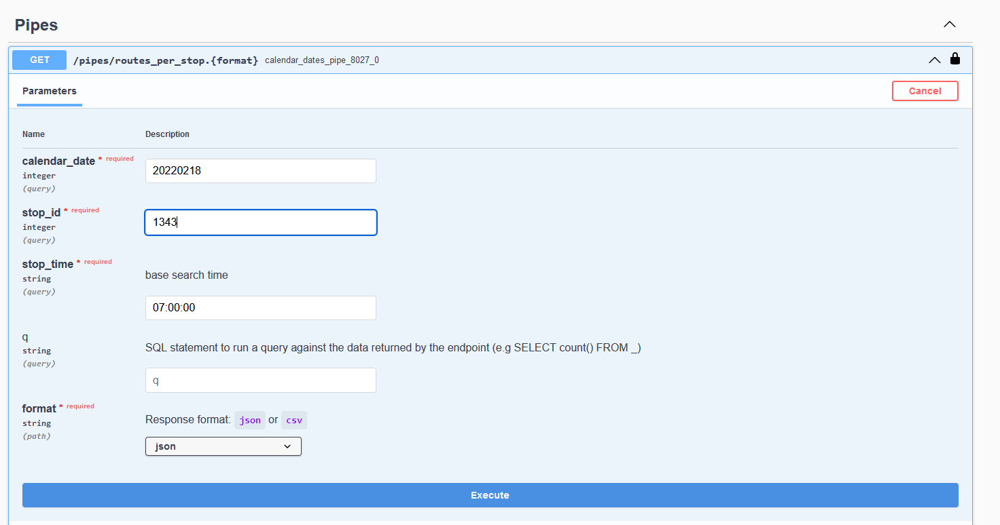
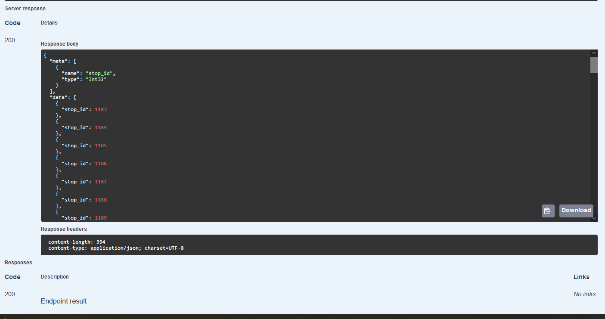

# titsa-gtfs-api


This brief project exposes the current open data available from [Titsa](https://transitfeeds.com/p/transportes-interurbanos-de-tenerife/1058) (Bus Service on Tenerife)

And for getting that wonderful system working I'm using [tinybird](https://www.tinybird.co/)

Note: I found the cli so easy to use that most of the samples have been adapted to use the cli interally and pount to the docs. 

If you register on tinybird the free tier would be enough. 

Advantages:
* It would expose the api quite soon (also with parameter support!) So we will have a quick api call - query in seconds
* It will be able to load the data directly
* The data could be processed before hand for diminishing data scanning.
* Its a wonderful experience.



# 1.Loading data

UI: 

If we go to the transitfeed url we will be able to download the last dataset available (in my case April 1st). Also you can go to the oficial titsa page and use this script I used for analysis: https://github.com/adrianabreu/titsa-gtfs-exploration/blob/master/download.sh

When we get the internal files we should rename then to csv, we will use everyone but the agency:

```
|
|_calendar_dates.csv
|_routes.csv
|_stop_times.csv
|_stops.csv
|_trips.csv
```

Then we need to register on tinybird (seriously the ui is so good I will skip it that part and also [here is the official guide](https://www.tinybird.co/guide/intro-to-ingesting-data)) and start adding the files as data sources>



Automatic:

Clone the repo and start docker compose. It uses the [tinybird oficial docker image](https://docs.tinybird.co/cli.html#option-2-use-a-prebuilt-docker-image)

Configure the auth as shown [here](https://docs.tinybird.co/cli.html#authenticate) (Again the oficial docs are so good)

Launch the command './scripts/load-batch-titsa.sh'

This will download the zip file from TITSA's webpage unzip it and load all the data files into tinybird as sources.


# 2.Transforming the data

## UI

When we get all the data we will be able to generate a pipeline. Quoting: "Pipelines are just like notebook cells" and they can be easy parametizable. But this will be better shown with an example.

I want: An endpoint that given the current stop I'm interested in, the proper date and time, returns me the next 5 five "guaguas" (buses for the non cuban - canarian people) that will arrive to that stop. 

So... Let's write the query, for the sake of avoiding parameter parsing I'm considering that the caller is splitting the datetime into two params as the calendar dates use the yyyymmdd and the stop times uses only the HH:MM:SS (so i don't have to deal with the +24 hours)

```
%
select routes.route_short_name as name, routes.route_long_name as headsign, stop_times.arrival_time as arrival
from routes 
inner join trips on routes.route_id = trips.route_id 
inner join calendar_dates on trips.service_id = calendar_dates.service_id 
inner join stop_times on stop_times.trip_id = trips.trip_id
where calendar_dates.date = {{Int64(calendar_date, 20220301, 'date of the service you are looking for as int YYYYMMDD', required=True)}}
AND stop_times.stop_id = {{Int64(stop_id, 1199, 'Stop id findable in titsa page', required=True)}} 
AND stop_times.arrival_time >= {{String(stop_time, '08:00:00', description='base search time', required=True)}}
order by arrival
limit 5
```

In the query there are two parameters defined using the template tinybird provides and all the query is done at once.

So we click on "publish as api" and that's it. We got an api. (I also expected some more steps, but no, seriously, that's all).

## Automatically 
Now I'm going to transform the data as a typical query could be, ok, so where does this line goes? Does this line goes through that stop? 
For that tinybird recommends using a [**materialized view**](https://www.tinybird.co/guide/materialized-views)

The following bash script './scripts/generate-stops-per-line.sh' will:

1. Create a new data source with the desired relation - line / stop_id so we can get all the codes for each line
2. Create a pipe performing the desired query
3. Push both the data source and the filling pipe against tinybird
4. Set up and endpoint for querying the new data source with the desired parameter. 

Yeah all in a single script with most of the data being strings.

# 3. Exploring results

Now that is ready I want to try it, I will start downloading postman and then...

Oh wait, tinybird includes swagger! (Just click in view api on top right and then 'open in swagger' and the bottom)



And here I'm looking for the buses for going to college are over again!

```
{
  "meta": [
    {
      "name": "name",
      "type": "Int32"
    },
    {
      "name": "headsign",
      "type": "String"
    },
    {
      "name": "arrival",
      "type": "String"
    }
  ],
  "data": [
    {
      "name": 105,
      "headsign": "SANTA CRUZ -> PUNTA DEL HIDALGO-POR LA LAGUNA",
      "arrival": "07:07:04"
    },
    {
      "name": 57,
      "headsign": "< > 51  CIRCULAR LA LAGUNA -> TEJINA - TACORONTE- LA LAGUNA",
      "arrival": "07:12:11"
    },
    {
      "name": 105,
      "headsign": "SANTA CRUZ -> PUNTA DEL HIDALGO-POR LA LAGUNA",
      "arrival": "07:17:53"
    },
    {
      "name": 50,
      "headsign": "LA LAGUNA -> TEGUESTE -BAJAMAR- PUNTA DEL HIDALGO",
      "arrival": "07:34:30"
    },
    {
      "name": 57,
      "headsign": "< > 51  CIRCULAR LA LAGUNA -> TEJINA - TACORONTE- LA LAGUNA",
      "arrival": "07:47:46"
    }
  ],
  "rows": 5,
  "rows_before_limit_at_least": 75,
  "statistics": {
    "elapsed": 0.085179922,
    "rows_read": 767212,
    "bytes_read": 21641662
  }
}
```

From the automatic pipeline:



# 4. Realtime Data

Now that we loaded the gtfs format we need to get compare it against the real data. Tisa has a [public API](), you will need to rquest a token from it.


## Loading data

We will take advantage of the free minutes github gives us. You can see the **load_realtime** folder. Inside, there is a python module with all the needed data. It parses the xml response and feeds two data_sources in tinybird: one with the realtime and the other one with statistics about the api fails. (It fails a lot and I'm tired of getting alerts, so I'm going to check that data).

You can see how the python module is loaded in the .github/workflows folder. But it is quite simple, the trick here for saving time is to build the project with its dependencies locally so it takes a few seconds to make the call. 

You can do this with the following commands:

`pip install -r requirements.txt --target load_realtime`
`python -m zipapp load_realtime`

With this we will bne gneerating a load_realtime.pyz file that will have all the deps.
A typical execution will took about 20 secs. Github provides 2000 build minutes free per months, so we will be able to launch about 200 requests per day. 

## Checking the results

I have used the neighbor function for grabbing all the estimated data and compared it against the guesses. You can see the query in the scripts file. Over there I just created a pipe that grabs two dates. Here is a sample response from the api call:

```
{
  "meta": [
    {
      "name": "date",
      "type": "String"
    },
    {
      "name": "acc_diff_in_seconds",
      "type": "Nullable(Int64)"
    }
  ],
  "data": [
    {
      "date": "2022-10-07",
      "acc_diff_in_seconds": 9722
    },
    {
      "date": "2022-10-09",
      "acc_diff_in_seconds": 578
    },
    {
      "date": "2022-10-08",
      "acc_diff_in_seconds": 924
    },
    {
      "date": "2022-10-06",
      "acc_diff_in_seconds": 9760
    },
    {
      "date": "2022-10-04",
      "acc_diff_in_seconds": 9495
    },
    {
      "date": "2022-10-03",
      "acc_diff_in_seconds": 10468
    },
    {
      "date": "2022-10-05",
      "acc_diff_in_seconds": 10288
    }
  ],
  "rows": 7,
  "statistics": {
    "elapsed": 0.126348496,
    "rows_read": 2441666,
    "bytes_read": 68676194
  }
}
```

I will try to draw a frontend with this!